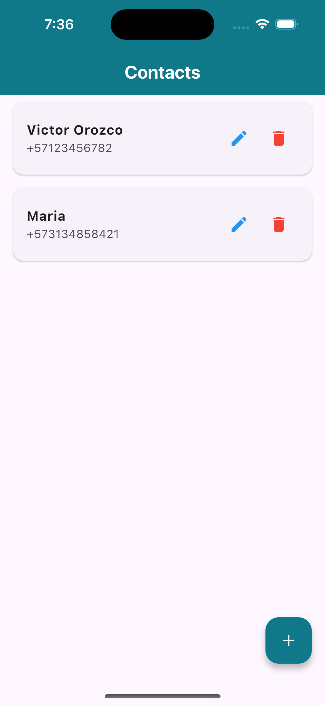
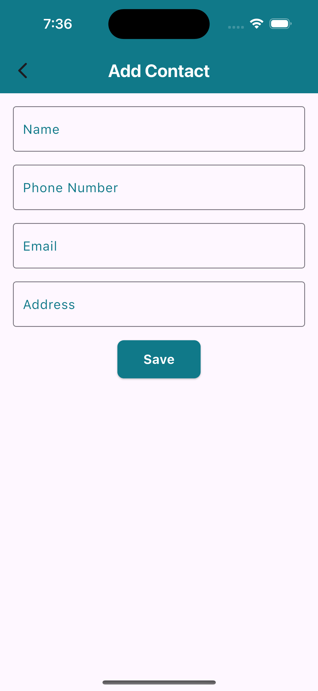
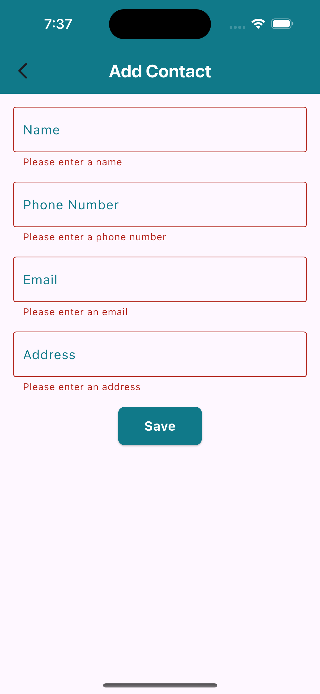
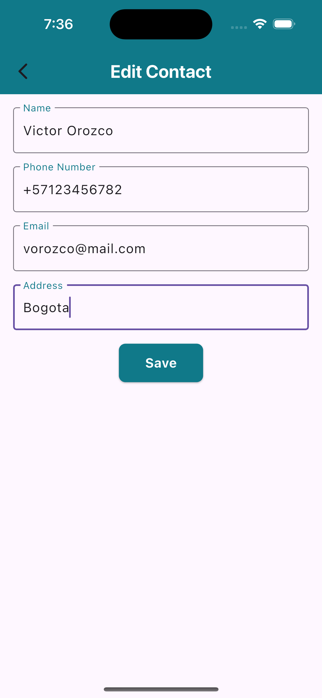

# Stori App

Stori App is a Flutter application for managing contacts. It provides functionality to create, read, update, and delete contacts using a RESTful API.

## Features

- View a list of contacts
- Add new contacts
- Edit existing contacts
- Delete contacts

## Getting Started

### Prerequisites

- Flutter (latest stable version)
- Dart SDK
- Android Studio
- Xcode

### Installation

1. Clone the repository:
   ```
   git clone https://github.com/victororozco/stori_app.git
   ```

2. Navigate to the project directory:
   ```
   cd stori_app
   ```

3. Install dependencies:
   ```
   flutter pub get
   ```

4. Run the app:
   ```
   flutter run
   ```

## Project Structure

- `lib/`
  - `models/` - Data models
  - `screens/` - UI screens
  - `services/` - API services
  - `main.dart` - Entry point of the application

- `test/` - Unit and widget tests

## Testing

To run the tests, use the following command:

```
flutter test
```

## API Integration

The app uses a RESTful API for contact management. The base URL for the API can be configured by setting the `BASE_URL` environment variable. If not set, it defaults to `http://localhost:8000/api`.

## Screenshots
### Home


### Add new Contact



### Edit

